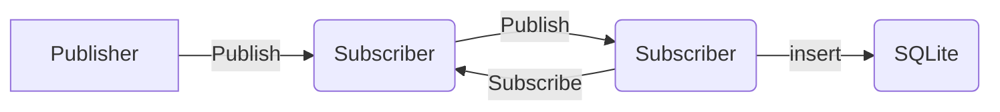

# MQTT project

The MQTT project repository is an example of how to use MQTT protocol in Python using the Paho MQTT client library. It provides scripts for publishing and subscribing to messages on an MQTT broker.

## Files
- publisher.py
Client connects to an MQTT broker and publishes messages to a specified topic. It also reads data from an Excel file, converts it to a JSON format, and publishes the JSON data.
- subscriber.py
Client subscribes to an MQTT broker, receives messages, and saves data into a database.
- create_db.py
Create a SQLite database file and a table schema with columns.
- DatabaseManager.py
Manages the SQLite database which receives JSON data and inserts it into the table in the database.

- SampleInput.xlsx
An example of a file for receiving and sending data.

## Consists of 3 entities

- **Client**: Publisher and Subscriber
- **Broker**: Mosquitto and Paho
- **Server**: SQLite

## System

