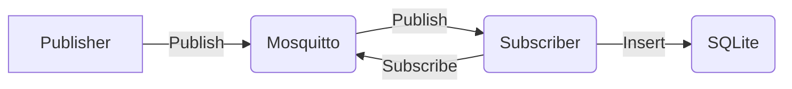

# MQTT project

The MQTT project repository is an example of how to use MQTT protocol in Python using the Paho MQTT client library. It provides scripts for publishing and subscribing to messages on an MQTT broker and save data into database.

## System



## Consists of 3 entities
- **Client**: Client can read sensor data stored in an Excel file and sends to Broker.
- **Broker**: Broker forwards any data it receives to its subscribers using Mosquitto and Paho
- **Server**: Subscribes for data from Client and save into SQLite


## Files
- **publisher.py:** 
Client connects to an MQTT broker and publishes messages to a specified topic. It also reads data from an Excel file, converts it to a JSON string format, and publishe the data.
- **subscriber.py:** 
Client subscribes to an MQTT broker, receives messages, and saves data into a database.
- **create_db.py:** 
Create a SQLite database file and a table schema with columns.
- **DatabaseManager.py:** 
Manages the SQLite database which receives JSON data and inserts it into the table in the database.
- **SampleInput.xlsx:**  
An example of a file for receiving and sending data.

## How to run

1. Run the subscriber file by typing "python subscriber.py" in the terminal and pressing enter. 
``` bash
python subscriber.py
```
2. Run the publisher file by typing "python publisher.py" in the terminal and pressing enter. 
``` bash
python publisher.py


